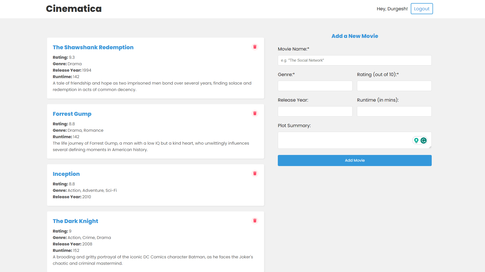

# Cinematica: Track Your Movies and Shows

Cinematica is a feature-rich MERN (MongoDB, Express, React, Node.js) application that allows users to seamlessly track and manage the movies and shows they watch or plan to watch. With user account management, full CRUD (Create, Read, Update, Delete) functionality, and a user-friendly interface, Cinematica is your go-to tool for organizing your entertainment preferences.

## Deployment

The app is deployed on Vercel. Check it out [here](https://cinematica-mern.vercel.app/).



## Key Features

- **User Accounts**: Create and sign in to manage your collection.
- **Add Movies and Shows**: Quickly add details like name, duration, release year, genre, plot, and rating.
- **Rate Movies**: Keep a record of your movie ratings for future reference.
- **Track Shows**: Cinematica supports TV shows, tracking seasons and episodes.
- **Edit and Delete**: Easily manage your collection by editing or removing entries.

## Upcoming Features

We're adding more features to make Cinematica even better:

- [ ] **Enhanced Show Support**: Track your favorite shows with ease, including seasons and episodes.
- [ ] **Sorting and Filtering**: Sort and filter your collection by name, rating, genre, and more.
- [ ] **Favorites **: Keep a list of your favorite movies and shows.
- [x] **Custom Usernames**: Personalize your profile with a custom username.
- [x] **Edit Movies/Shows**: Edit your entries to keep your collection up-to-date.
- [x] **Mobile Responsive**: Access Cinematica on the go with a mobile-friendly interface.
- [x] **Branding**: Add branding to make Cinematica look and feel even better.

Cinematica is your ultimate tool for organizing your movie and show preferences.

## Getting Started

1. Clone this repository.

   ```shell
   git clone https://github.com/yodkwtf/cinematica-mern.git
   ```

2. Install server dependencies:

   ```shell
   cd server
   npm install
   ```

3. Install client dependencies:

   ```shell
   cd client
   npm install
   ```

4. Create a `.env` file in the `server` directory and add the following:

   ```.env
   PORT=5000
   MONGO_URI=mongodb+srv://<username>:<password>@<cluster-url>/<database-name>?retryWrites=true&w=majority
   JWT_SECRET=some_secret_string
   ```

5. Run the server:

   ```shell
   cd server
   npm run dev
   ```

6. Run the client:

   ```shell
   cd client
   npm start
   ```

7. Open [http://localhost:3000](http://localhost:3000) to view the client and [http://localhost:5000](http://localhost:5000) to view the server in the browser.

## Contact

- Email: 48durgesh.kumar@gmail.com
- GitHub: [@yodkwtf](https://github.com/yokdwtf)
- LinkedIn: [Durgesh Chaudhary](https://www.linkedin.com/in/durgesh-chaudhary/)
